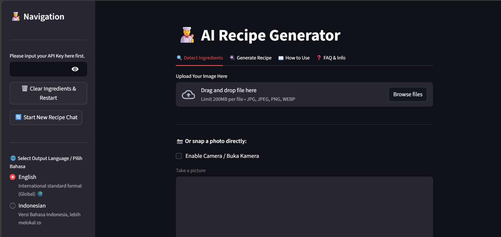
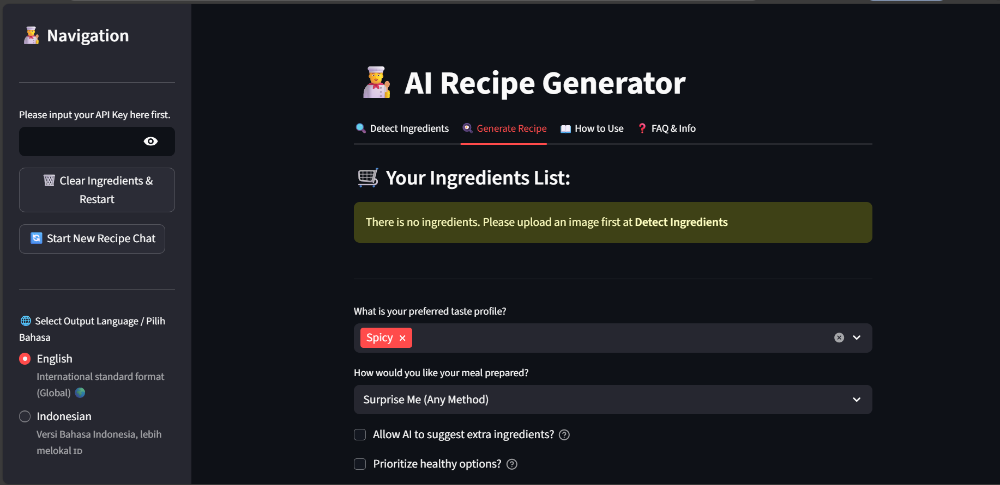
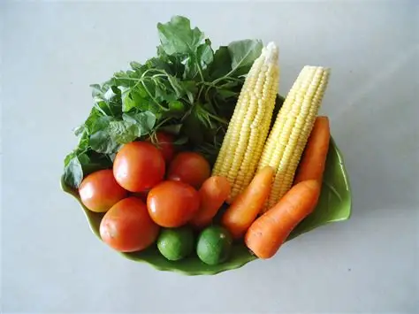
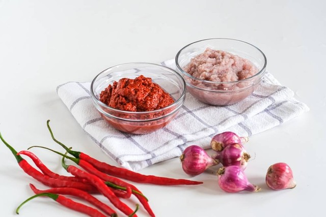

# 👨‍🍳 Chef AI: Your Personal Culinary Assistant


## 📌 Overview
**Chef AI** is an intelligent recipe generator that turns your available ingredients into delicious meals. Powered by **Google Gemini Vision** and **LangChain**, this application allows users to upload photos of their fridge or pantry, automatically detects ingredients, and generates tailored recipes based on specific dietary preferences, cooking methods, and flavor profiles.

Whether you are a beginner looking for a quick meal or a home cook wanting to try something new, Chef AI adapts to your needs using dynamic prompt engineering and agentic reasoning.

## ✨ Key Features

### 📸 Visual Ingredient Detection
Gone are the days of manual typing. Chef AI utilizes **Gemini's Multimodal capabilities** to analyze images of food:
* **Snap & Scan:** Upload an image or take a photo directly via the app.
* **Auto-Listing:** The AI identifies ingredients and lists them in a bulleted format.
* **Manual Override:** Users can edit the detected list to fix typos or add missing items.

### 🧠 Adaptive Recipe Engine
The core of the application relies on a sophisticated **Dynamic Prompting System** that tailors the recipe to be direct and efficient based on user settings:
* **Smart Configuration:** Users can define specific parameters that the AI must follow:
    * **Flavor Profile:** (e.g., Savory, Spicy, Umami).
    * **Cooking Method:** (e.g., Stir-fry, Steam, "Surprise Me").
    * **Dietary Rules:** (e.g., Healthy/Low Calorie).
    * **Inventory Control:** Strict (use only what I have) vs. Flexible (allow shopping for extras).
* **Efficiency First:** The engine is optimized to generate clear, structured, and fast recipes (Ingredients + Instructions) without unnecessary fluff to save API quota and reduce latency.

### 💬 Interactive Chef Chat
* **ReAct Agent:** Built with LangChain's `create_react_agent`, the Chef can reason through requests and even search the web (via DuckDuckGo) if needed.
* **Contextual Memory:** The Chef remembers the ingredients and conversation history, allowing for follow-up tweaks (e.g., *"Make it spicier"* or *"Change chicken to tofu"*).

### 🛡️ Robust Error Handling
* **Quota Management:** Automatically detects `429 Quota Exceeded` errors from the API and suggests solutions (switching models or waiting).
* **API Key Security:** Keys are handled via session state and never stored permanently.

## 🛠️ Tech Stack
* **LLM Provider:** Google Generative AI (Gemini 2.5 Flash).
* **Vision Model:** Gemini Vision (for image analysis).
* **Framework:** Streamlit (Frontend & State Management).
* **Orchestration:** LangChain (Agents, Memory, Tools).
* **Image Processing:** Pillow (PIL).
* **Search Tool:** DuckDuckGo Search API.

## 🚀 How It Works
1.  **Authentication:** User inputs their Google API Key.
2.  **Detection:** User uploads a photo. The Vision model extracts ingredients.
3.  **Configuration:** User selects preferences (Spicy, Frying, Healthy Mode).
4.  **Prompt Engineering:** The system builds a dynamic system prompt based on the configuration.
5.  **Generation:** The LangChain Agent processes the request and outputs the structured recipe.

## 📦 Installation & Usage

1.  **Clone the Repository**
    ```bash
    git clone https://github.com/viochris/ai-recipe-generator.git
    cd ai-recipe-generator
    ```

2.  **Install Dependencies**
    ```bash
    pip install -r requirements.txt
    ```

3.  **Run the Application**
    ```bash
    streamlit run koki.py
    ```

4.  **Getting Started**
    * Get your API Key from [Google AI Studio](https://aistudio.google.com/).
    * Enter the key in the Sidebar.
    * Go to **Tab 1** to scan your food, then **Tab 2** to cook!

## 📷 Gallery & Demos

### 🖥️ Application Interface

**1. Phase 1: Ingredient Detection** The AI scans the image, identifies ingredients, and lets you edit the list if needed.


**2. Phase 2: The Chef's Recipe** Based on your ingredients and preferences (Spicy, Healthy, etc.), the Agent crafts a unique recipe.


---

### 🥗 Sample Inputs (Try these!)
Don't have ingredients ready? You can use these sample images provided in the `assets/` folder to test the capabilities of the Vision Model:

<p float="left">
  
  &nbsp; &nbsp; 
</p>

**Author:** [Silvio Christian, Joe](https://www.linkedin.com/in/silvio-christian-joe)
*"Turning leftovers into gourmet meals, one prompt at a time."*
