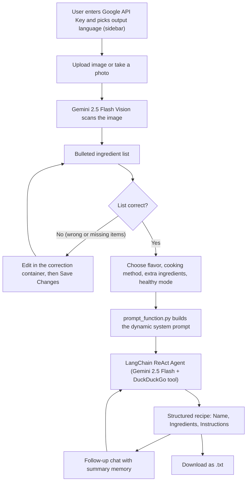
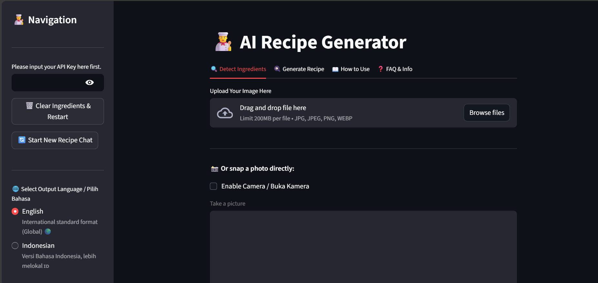
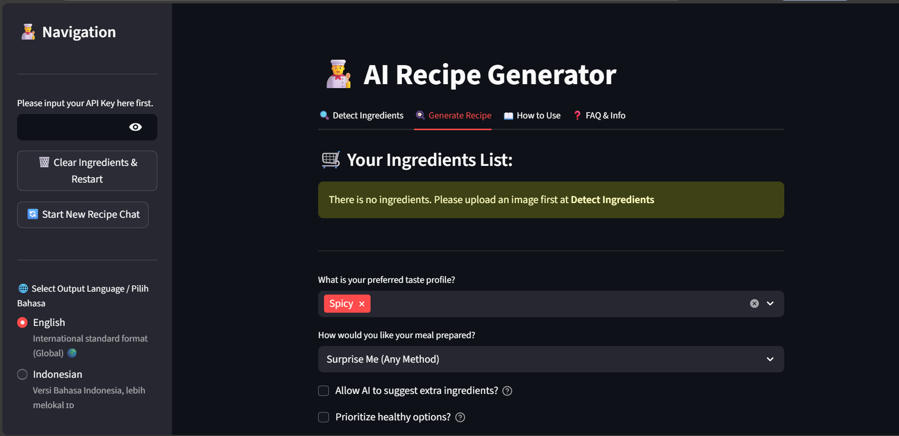
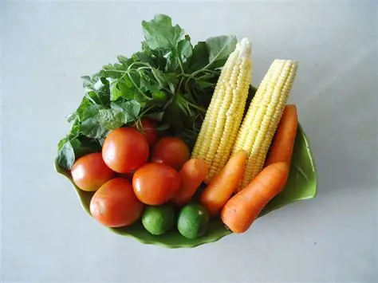
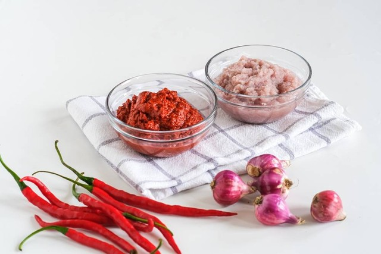

# 👨‍🍳 Chef AI: Your Personal Culinary Assistant


[](https://ai-recipe-generator-6fajjxbnjpb2dcnqjvvvvy.streamlit.app/)

## 📌 Overview
**Chef AI** is an intelligent recipe generator that turns your available ingredients into delicious meals. Powered by **Google Gemini Vision** and **LangChain**, this application allows users to upload photos of their fridge or pantry, automatically detects ingredients, and generates tailored recipes based on specific dietary preferences, cooking methods, and flavor profiles.

Whether you are a beginner looking for a quick meal or a home cook wanting to try something new, Chef AI adapts to your needs using dynamic prompt engineering and agentic reasoning.

Under the hood, the app is a two-phase pipeline wrapped in a single Streamlit interface. Phase 1 uses Gemini's multimodal vision to read a photo and produce an *editable* ingredient list. Phase 2 feeds that list, together with the user's preferences, into a LangChain ReAct agent that writes the recipe and keeps chatting with you to refine it. The interface is available in both **English** and **Indonesian**, and every recipe can be downloaded as a `.txt` file.

> 🔗 **Try it live:** [ai-recipe-generator on Streamlit Cloud](https://ai-recipe-generator-6fajjxbnjpb2dcnqjvvvvy.streamlit.app/). You will need your own Google Gemini API key.

### ✨ At a Glance
* 📸 **Photo to ingredients.** Upload an image or snap one with your camera, and Gemini Vision lists what it sees.
* ✏️ **Human in the loop.** The detected list is never final. You can edit, fix, or replace it before any recipe is generated.
* 🎛️ **Preference-driven recipes.** Flavor profile, cooking method, strict vs. flexible ingredient rules, and healthy mode all reshape the prompt.
* 💬 **Chat to refine.** Ask for tweaks like *"Make it spicier"* and the Chef remembers the context.
* 🌐 **Bilingual output.** Switch between English and Indonesian from the sidebar.

---

## ✨ Key Features

### 📸 Visual Ingredient Detection
Gone are the days of manual typing. Chef AI utilizes **Gemini's Multimodal capabilities** to analyze images of food:
* **Snap & Scan:** Upload an image or take a photo directly via the app.
* **Auto-Listing:** The AI identifies ingredients and lists them in a bulleted format.
* **Manual Override:** Users can edit the detected list to fix typos or add missing items.
* **Supported Formats:** `jpg`, `jpeg`, `png`, and `webp` uploads, plus live camera capture (the camera is opt-in through a checkbox, so it is never switched on by default).
* **Strict Output Format:** The detection prompt asks for a bulleted list only, with no introduction or closing remarks.

### 🧠 Adaptive Recipe Engine
The core of the application relies on a sophisticated **Dynamic Prompting System** that tailors the recipe to be direct and efficient based on user settings:
* **Smart Configuration:** Users can define specific parameters that the AI must follow:
    * **Flavor Profile:** (e.g., Savory, Spicy, Umami).
    * **Cooking Method:** (e.g., Stir-fry, Steam, "Surprise Me").
    * **Dietary Rules:** (e.g., Healthy/Low Calorie).
    * **Inventory Control:** Strict (use only what I have) vs. Flexible (allow shopping for extras).
* **Efficiency First:** The engine is optimized to generate clear, structured, and fast recipes (Ingredients + Instructions) without unnecessary fluff to save API quota and reduce latency.
* **Multi-Select Flavors:** Seven flavor profiles (Savory, Spicy, Sweet, Sour, Umami, Salty, Bitter) can be combined, for example *Sweet & Spicy*. Each one injects its own objective, key ingredients, technique, and balance rule into the prompt.
* **Eight Cooking Methods:** Surprise Me, Fry, Sauté / Stir-fry, Boil / Soup, Steam, Bake / Roast, Grill / BBQ, and Raw / Salad, each with method-specific guidance.
* **Modular Prompt Builders:** Every setting is handled by its own function in `prompt_function.py`, and a final builder stitches them into one system prompt with strict language and output-format rules.
* **Bilingual Recipes:** The prompt instructs the model to write all recipe headers and content in the selected language (English or Indonesian).

### 💬 Interactive Chef Chat
* **ReAct Agent:** Built with LangChain's `create_react_agent`, the Chef can reason through requests and even search the web (via DuckDuckGo) if needed.
* **Contextual Memory:** The Chef remembers the ingredients and conversation history, allowing for follow-up tweaks (e.g., *"Make it spicier"* or *"Change chicken to tofu"*).
* **Summary Memory:** Conversation context is kept through LangChain's `ConversationSummaryMemory`.
* **Conversation History:** Previous messages are listed in a collapsible "Conversation History" panel above the chat box.
* **One-Click Export:** Download the latest recipe as a `.txt` file.

### 🛡️ Robust Error Handling
* **Quota Management:** Automatically detects `429 Quota Exceeded` errors from the API and suggests solutions (waiting a few minutes or trying again tomorrow).
* **API Key Security:** Keys are handled via session state and never stored permanently.
* **Invalid Key Detection:** An invalid API key triggers a clear message in the interface.
* **Graceful Fallback:** Any other technical error is shown as readable error details.

### 🧯 Handling Wrong or Non-Food Images
Chef AI does not run a separate check to verify that an uploaded photo really contains food. If a non-food image is sent, the app keeps running without raising an error. This is handled on the user's side through the following:
* **Editable Ingredient Container:** Below the detected list, an **"✏️ Need corrections? Click here to Edit"** panel lets the user fix typos, delete wrong items, add missing ones, or replace the whole list with their own.
* **Save Changes Button:** Edits only take effect after clicking **✅ Save Changes**, and the saved list is the one used in the recipe stage.
* **Clear & Restart Button:** One click in the sidebar wipes the ingredient list and resets both the upload and camera widgets, so a wrong photo can be discarded.
* **Empty Result Warning:** If the model returns nothing, the app shows a "No ingredients detected" warning.

---

## 🎯 Context & Problem Statement

Chef AI is built around a simple everyday situation: you have some ingredients at home but no idea what to cook with them. Two things make that harder than it needs to be.

### 🥘 The Problem
1. **Listing ingredients by hand is tedious.** Starting from "what I have" means typing every item before any recipe can be suggested.
2. **A fixed recipe does not adapt to your preferences.** A recipe may use a cooking method or flavor you don't want, or call for extra ingredients you don't have.

### 💡 The Solution
Each of them maps onto a part of the application:
1. 📸 **Addressing manual ingredient entry.** Gemini Vision reads a photo of the fridge or pantry and produces the ingredient list automatically. Since the result may be incomplete or wrong (for example with an unclear photo or a non-food image), the detected list can be edited before it is used.
2. 🧠 **Addressing one-size-fits-all recipes.** A dynamic prompting system converts the user's flavor, method, dietary, and inventory choices into instructions for the agent, and the chat lets the user keep refining the recipe with follow-up requests.

---

## 🛠️ Tech Stack
* **LLM Provider:** Google Generative AI (Gemini 2.5 Flash).
* **Vision Model:** Gemini Vision (for image analysis).
* **Framework:** Streamlit (Frontend & State Management).
* **Orchestration:** LangChain (Agents, Memory, Tools).
* **Image Processing:** Pillow (PIL).
* **Search Tool:** DuckDuckGo Search API.

### 🧩 Component Roles

| Layer | Tool | Role |
| :--- | :--- | :--- |
| **Frontend & state** | Streamlit (`st.session_state`, tabs, sidebar, chat UI) | Four-tab interface, API key input, language switch, reset buttons, and in-session memory |
| **Vision** | `google-genai` client with Gemini 2.5 Flash | Reads the uploaded or captured image and returns a bulleted ingredient list |
| **Image handling** | Pillow (PIL) | Opens the uploaded or camera image before it is sent to the vision model |
| **Agent reasoning** | LangChain `create_react_agent` + `AgentExecutor` | Reason-and-act loop that writes the recipe and decides when to call a tool |
| **Prompt template** | `hwchase17/react-chat` from LangChain Hub | Base ReAct chat template, extended with the Chef persona and user settings |
| **LLM wrapper** | `langchain-google-genai` (`ChatGoogleGenerativeAI`, temperature 0.7) | Connects the agent to Gemini 2.5 Flash |
| **Memory** | `ConversationSummaryMemory` | Keeps a running summary of the conversation for follow-up edits |
| **Web search tool** | `DuckDuckGoSearchRun` | Lets the Chef look things up when it needs outside information |
| **Dynamic prompting** | `prompt_function.py` | Builds flavor, cooking method, dietary, and ingredient-rule instructions, then assembles the final system prompt |

---

## 🚀 How It Works
1.  **Authentication:** User inputs their Google API Key.
2.  **Detection:** User uploads a photo. The Vision model extracts ingredients.
3.  **Configuration:** User selects preferences (Spicy, Frying, Healthy Mode).
4.  **Prompt Engineering:** The system builds a dynamic system prompt based on the configuration.
5.  **Generation:** The LangChain Agent processes the request and outputs the structured recipe.

### 🔄 Application Flowchart


```mermaid
flowchart TD
    A["User enters Google API Key and picks output language (sidebar)"] --> B["Upload image or take a photo"]
    B --> C["Gemini 2.5 Flash Vision scans the image"]
    C --> D["Bulleted ingredient list"]
    D --> E{"List correct?"}
    E -- "No (wrong or missing items)" --> F["Edit in the correction container, then Save Changes"]
    F --> D
    E -- "Yes" --> G["Choose flavor, cooking method, extra ingredients, healthy mode"]
    G --> H["prompt_function.py builds the dynamic system prompt"]
    H --> I["LangChain ReAct Agent (Gemini 2.5 Flash + DuckDuckGo tool)"]
    I --> J["Structured recipe: Name, Ingredients, Instructions"]
    J --> K["Follow-up chat with summary memory"]
    K --> I
    J --> L["Download as .txt"]
```

### 🔁 Session Behavior Worth Knowing
* Changing the flavors, cooking method, extra-ingredient toggle, or healthy mode **rebuilds the agent and clears the chat**, so every recipe is consistent with the active settings.
* Changing the **output language** also clears the detected ingredient list and the last recipe, so you need to run **🔍 Detect Ingredients** again after switching languages. Uploading or capturing a new image resets them the same way.
* **🔄 Start New Recipe Chat** clears the conversation but keeps the current ingredient list.
* **🗑️ Clear Ingredients & Restart** removes the ingredient list, the chat, and resets both the upload and camera widgets.
* Everything lives in Streamlit session state, so refreshing the page wipes the session.

---

## 📦 Installation & Usage

### 📋 Prerequisites
* **Python** 3.9+
* **Package Manager** pip
* A **Google Gemini API Key** (subject to the quota limits of your Google account or plan)
* An internet connection, since the app calls the Gemini API, pulls the ReAct prompt template from LangChain Hub, and uses DuckDuckGo search

### 🛠️ Setup

1.  **Clone the Repository**
    ```bash
    git clone https://github.com/viochris/ai-recipe-generator.git
    cd ai-recipe-generator
    ```

2.  **Install Dependencies**
    ```bash
    pip install -r requirements.txt
    ```

3.  **Run the Application**
    ```bash
    streamlit run koki.py
    ```

4.  **Getting Started**
    * Get your API Key from [Google AI Studio](https://aistudio.google.com/).
    * Enter the key in the Sidebar.
    * Go to **Tab 1** to scan your food, then **Tab 2** to cook!

> ℹ️ **Note:** `requirements.txt` does not pin Streamlit, and the app uses newer Streamlit options (`show_time` on `st.spinner` and `on_click="ignore"` on `st.download_button`). If you hit an error about those arguments, upgrade with `pip install --upgrade streamlit`.

> 💡 **Tip:** A virtual environment is recommended to avoid dependency conflicts (`python -m venv venv`, then activate it before running `pip install`).

### 🗂️ Project Structure

```text
ai-recipe-generator/
├── koki.py               # Main Streamlit app: UI, vision detection, agent, chat, state
├── prompt_function.py    # Dynamic prompt builders (flavor, method, diet, extras, final prompt)
├── requirements.txt      # Python dependencies
├── assets/               # Screenshots and sample input images
│   ├── detection_preview.png
│   ├── recipe_preview.png
│   ├── ingredients_example_1.webp
│   └── ingredients_example_2.jpg
├── LICENSE
└── README.md
```

---

## 📷 Gallery & Demos

### 🖥️ Application Interface

**1. Phase 1: Ingredient Detection** The AI scans the image, identifies ingredients, and lets you edit the list if needed.


**2. Phase 2: The Chef's Recipe** Based on your ingredients and preferences (Spicy, Healthy, etc.), the Agent crafts a unique recipe.


---

### 🥗 Sample Inputs (Try these!)
Don't have ingredients ready? You can use these sample images provided in the `assets/` folder to test the capabilities of the Vision Model:

<p float="left">
  
  &nbsp; &nbsp; 
</p>

---

## ⚠️ System Limitations

### 🏗️ Architectural Limitations
* **No built-in food validation.** The app does not check whether an uploaded image actually contains food. A non-food photo will not trigger an error, and the app keeps running. This is mitigated by the editable ingredient container described above, which lets the user correct or clear the list before cooking, but the check is manual rather than automatic.
* **Session-only memory.** All state lives in Streamlit session state. Refreshing the page erases the ingredient list, chat, and recipe, so favorite recipes should be downloaded or copied before closing the tab.
* **Bring your own API key.** The app depends on the user's own Gemini key and its quota. When the quota is exhausted, the user has to wait before generating anything else. Note that one chat message can consume several API calls, because the ReAct agent may reason in multiple steps and the summary memory also calls the model.
* **External dependencies at runtime.** The ReAct prompt template is pulled from LangChain Hub on each agent build, and the search tool relies on DuckDuckGo, so the app needs a working internet connection beyond the Gemini API itself.

### 🔬 Model & Domain Limitations
* **Vision accuracy depends on the photo.** Dark, blurry, or cluttered images can cause missed or misidentified ingredients.
* **Generated recipes are not guaranteed to be correct.** LLM output can contain odd combinations or inaccurate cooking times. Always make sure meat is thoroughly cooked and trust your own judgment over the AI when a step looks wrong.
* **Pantry staples are assumed.** Even in strict mode, basic seasoning (salt, pepper, water) is allowed, so a recipe may include items that were not scanned.
* **Dietary needs beyond the Healthy toggle are prompt-based.** Requirements such as Halal, Keto, or Vegan are handled by typing them into the chat, not by a dedicated filter, so they should be double-checked.

---

## 🚀 Future Work
* **Add an image validation step.** Run a lightweight check (for example, asking the vision model whether the image contains food before extracting ingredients) so non-food uploads are flagged automatically instead of relying only on manual correction.
* **Dedicated dietary filters.** Add built-in options for Halal, Vegetarian, Vegan, Keto, and allergen exclusion, rather than depending on chat instructions alone.
* **Persistent favorites.** Let users save recipes beyond a single session, for example through local storage or a small database.
* **Model selection in the UI.** Allow switching between Gemini models directly from the sidebar, which would also give users an option when one model hits its quota.
* **Nutrition estimates.** Show approximate calories and macros per serving alongside each recipe.
* **Portion and serving control.** Let users specify how many servings they need and scale quantities accordingly.

---

## 📄 License
This project is licensed under the **MIT License**. See the [LICENSE](LICENSE) file for details.

---
**Author:** [Silvio Christian, Joe](https://www.linkedin.com/in/silvio-christian-joe)
*"Turning leftovers into gourmet meals, one prompt at a time."*
